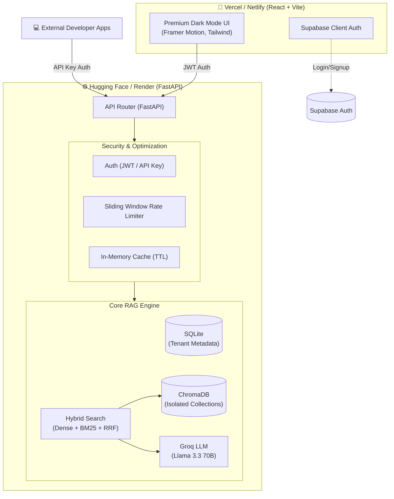

<div align="center">
  
# 🚀 Ragnium Multi-Tenant RAG Platform
### Enterprise-grade Retrieval-Augmented Generation as a SaaS

[](https://www.python.org/downloads/)
[](https://fastapi.tiangolo.com/)
[](https://react.dev/)
[](https://vitejs.dev/)
[](https://tailwindcss.com/)
[](https://supabase.com/)

A production-ready full-stack platform that lets any business upload documents and query them using natural language. Built with complete **tenant isolation**, **hybrid search**, and a **premium dark-mode UI**.

</div>

---

## ✨ Key Features

### 🧠 Advanced AI & Retrieval
- **Zero Hallucination by Design:** LLM answers are strictly grounded only in the uploaded documents.
- **Hybrid Search (RRF):** Combines dense vector embeddings (`all-MiniLM-L6-v2`) with sparse keyword search (BM25) and merges them using Reciprocal Rank Fusion for unparalleled accuracy.
- **Graceful Fallback:** If the LLM times out, the system automatically returns the most relevant raw text chunk instead of failing.

### 🏢 Enterprise Architecture
- **Strict Tenant Isolation:** Each tenant gets their own vector space and database rows. Data never leaks across boundaries.
- **Intelligent Caching:** Tenant-scoped, SHA-256 hashed in-memory query cache with TTL. Exact repeated queries return in `<10ms` with zero LLM cost.
- **Rate Limiting:** Sliding-window rate limiting per tenant to prevent abuse (e.g., 20 req/min).

### 🎨 Premium User Experience
- **Apple/Stripe-tier Design:** Built with React 19, Framer Motion, and Tailwind CSS.
- **Glassmorphism & Aurora:** GPU-accelerated aurora gradients, frosted glass cards, and immersive dark mode.
- **Smooth Interactions:** Lenis buttery-smooth scrolling, animated stat counters, and staggered page transitions.

### 🔐 Dual Security Model
- **Supabase JWTs:** Asymmetric `ES256` token validation for secure dashboard access.
- **API Key Auth:** `bcrypt` hashed, tenant-scoped API keys for developers integrating the RAG pipeline into their own apps.

---

## 🏗️ System Architecture



---

## 🚀 Local Development Quickstart

### 1. Start the Backend
The backend runs on Python/FastAPI and handles all AI logic.

```bash
# Clone the repository
git clone https://github.com/YOUR_USERNAME/multi-tenant-rag-api.git
cd multi-tenant-rag-api

# Setup Python virtual environment
python -m venv venv
source venv/bin/activate  # On Windows use: venv\Scripts\activate

# Install dependencies
pip install -r requirements.txt

# Configure environment variables
cp .env.example .env
# Edit .env and add your GROQ_API_KEY and SUPABASE config

# Start the server
uvicorn app.main:app --reload --port 8001
```
*API is now running at `http://localhost:8001` (Interactive docs at `/docs`)*

### 2. Start the Frontend
The frontend is a React 19 app that connects to the backend.

Open a **new terminal window**:
```bash
cd frontend

# Install dependencies
npm install

# Configure environment variables
cp .env.example .env
# Edit frontend/.env (ensure VITE_API_URL is http://localhost:8001)

# Start the development server
npm run dev
```
*Dashboard is now live at `http://localhost:5173`*

---

## 🌐 Production Deployment Guide

Deploying this platform is designed to be completely free using generous free tiers.

### Phase 1: Deploy Backend (Hugging Face Spaces)
1. Push your repository to GitHub.
2. Create a new **Docker Space** on [Hugging Face](https://huggingface.co/spaces).
3. Connect your GitHub repository.
4. In the Space settings, add all your variables from the root `.env` as **Space Secrets**.
5. Once deployed, note your direct API URL (it usually looks like `https://yourusername-spacename.hf.space`).

### Phase 2: Deploy Frontend (Vercel)
1. Log in to [Vercel.com](https://vercel.com) and click **Add New > Project**.
2. Import your GitHub repository.
3. Set the **Framework Preset** to `Vite`.
4. ⚠️ **CRITICAL:** Set the **Root Directory** to `frontend`.
5. Add your Environment Variables:
   - `VITE_API_URL`: Your Hugging Face URL from Phase 1.
   - `VITE_SUPERADMIN_EMAIL`: Your super admin email address.
   - `VITE_SUPABASE_URL`: Your Supabase project URL.
   - `VITE_SUPABASE_ANON_KEY`: Your Supabase anon key.
6. Click **Deploy**.

---

## 📚 API Integration Example

Developers can integrate your deployed backend into their own apps using the API key generated from the dashboard.

```bash
curl -X POST "https://your-deployed-backend-url.com/api/v1/query" \
  -H "Content-Type: application/json" \
  -H "X-API-Key: sk-your-generated-tenant-key" \
  -d '{
    "question": "What is our company refund policy?"
  }'
```

---

<div align="center">
  <i>Built with FastAPI, React, ChromaDB, Groq, and ❤️</i>
</div>
